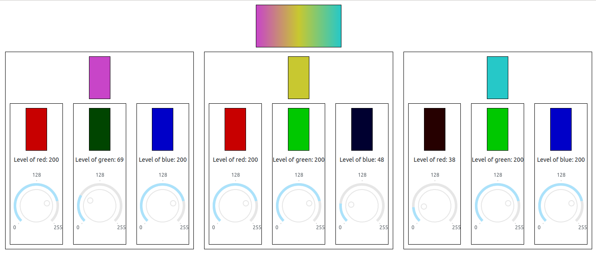

# Dash UI Compound Components (UICC)

Demonstration of how we can create compound Plotly Dash UI components
built as the combination of other components.

## Structure

This app shows a layout with
* a rectangle showing a color gradient formed from 3 colors.
* three color mixers, each providing one of the colors used to 
  form the gradient

Each color mixer is composed of
* one color mix box, with the result of adding three
  primary color levels
* three color level panels, one for each primary color

Each color level panel is composed of
* one box showing a color level
* a knob, allowing adjustment of the color level

## Properties
The demo shows
### Composition
UICC-s can be created as a composition of other components.

### Nesting
UICC-s can be composed of simple UI components or other UICC-s.

### Addressability
Callbacks can be defined using
* attributes of components in a UICC, or
* attributes of components in a UICC within another UICC,  
  up to any desired level of nesting.

## How to use
1. Clone this repo
   - `$ git clone __REPO_URL__`
2. Create an environment for your packages
   - `$ python -m venv venv`
   - `$ pip install -r requirements.txt`
3. Activate your environment
   - `$ source venv/bin/activate`
4. Run main.py
   - `venv/bin/python src/main.py`

## Requirements
* Python 3.8.10 or higher
* dash>=2.0
* dash-bootstrap-components
* dash_daq

**Author**: carlos.a.lang@intel.com